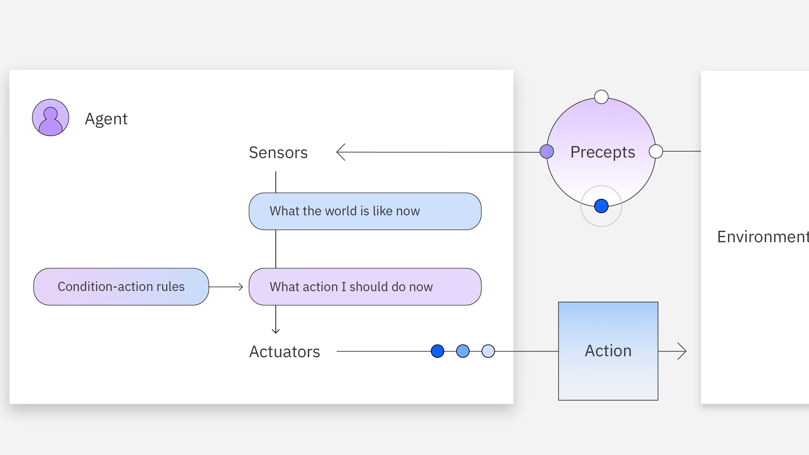
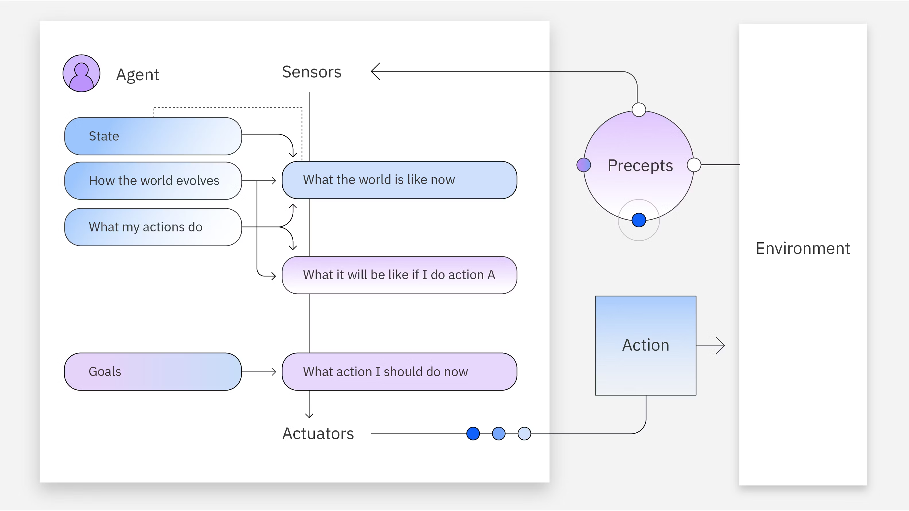
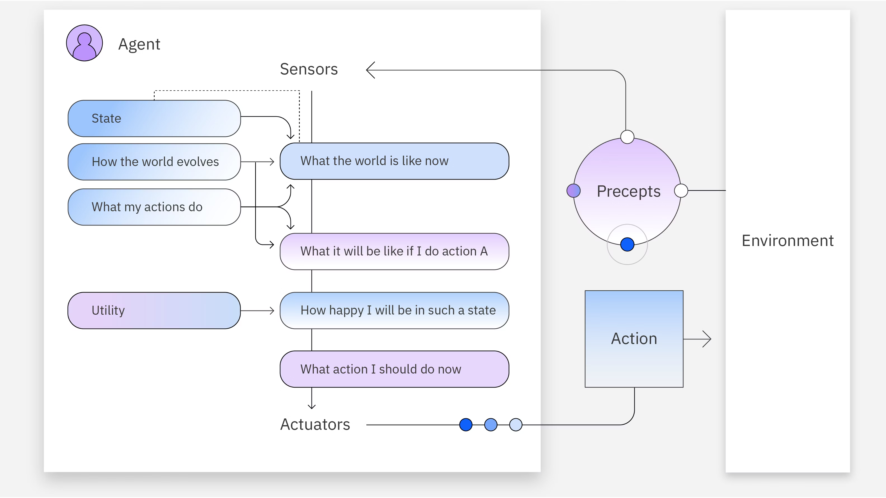
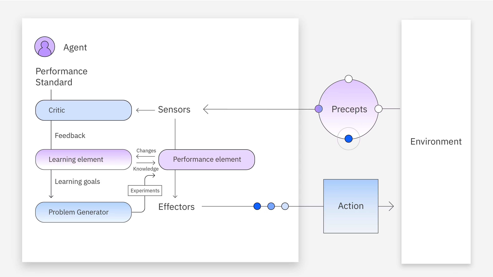

# AI 에이전트 개념

## AI 에이전트란?

AI 에이전트는 워크플로를 설계하고 사용 가능한 툴을 활용하여 사용자 또는 다른 시스템을 대신하여 **자율적으로 작업을 수행**할 수 있는 시스템입니다.

단순한 자연어 처리를 넘어 의사결정, 문제해결, 외부환경과의 상호작용, 작업 실행 등의 기능을 포함합니다.

이는 대규모 언어 모델(LLM)의 고급 자연어 처리 기술을 사용하여 사용자 입력을 **단계별**로 이해하고 응답하며 외부 도구를 호출할 시점을 결정합니다.

## AI 에어전트 작동 방식

기존 LLM은 학습에 사용된 데이터를 기반으로 응답을 생성하며 지식과 추론의 한계에 제약을 받습니다.

반면 에이전트 기술은 백엔드에서 툴 호출을 사용하여 최신 정보를 얻고, 워크플로를 최적화하며, 복잡한 목표를 달성하기 위해 자율적으로 하위 작업을 생성합니다.

이 세 단계 또는 에이전트 구성 요소는 에이전트가 작동하는 방식을 다음과 같이 정의합니다.

### 목표 초기화 및 계획 수립

AI 에이전트는 의사 결정 과정에서 자율적이지만 인간이 정의한 목표와 사전 정의된 규칙이 필요합니다.

사용자의 목표와 에이전트가 사용할 수 있는 툴이 주어지면 AI 에이전트는 작업 분해를 수행하여 성능을 개선합니다.

기본적으로 에이전트는 복잡한 목표를 달성하기 위해 특정 작업 및 하위 작업에 대한 계획을 수립합니다.

### 사용 가능한 도구를 이용한 추론

AI 에이전트는 자신이 인식한 정보를 기반으로 행동합니다.

그러나 복잡한 목표 안에 있는 모든 하위 작업을 처리하는 데 필요한 완전한 지식이 부족한 경우가 많습니다.

그래서 이 격차를 해소하기 위해 외부 데이터 세트, 웹 검색, API는 물론 다른 에이전트까지 동원합니다.

### 학습과 성찰

AI 에이전트는 다른 AI 에이전트 및 HITL(Human-in-the-Loop)과 같은 피드백 메커니즘을 사용하여 응답의 정확도를 높입니다.

피드백 메커니즘은 AI 에이전트의 추론과 정확성을 향상하며 이를 일반적으로 반복적 개선이라고 합니다. 동일한 실수를 반복하지 않기 위해 AI 에이전트는 이전 장애물의 솔루션에 대한 데이터를 지식 기반에 저장할 수도
있습니다.

## 에이전틱 AI 챗봇과 비에이전틱 AI 챗봇 비교

비에이전틱 AI 챗봇은 사용 가능한 툴, 메모리 또는 추론이 없는 챗봇으로, 단기적인 목표를 달성할 수 있을 뿐 앞으로의 계획을 세울 수는 없습니다.

반면, 에이전틱 AI 챗봇은 시간이 지남에 따라 사용자의 기대에 적응하는 방법을 학습하여 보다 개인화된 경험과 포괄적인 응답을 제공합니다.

## 추론 페러다임

| 구분        | ReAct (Reason + Act)                               | ReWOO (Reason Without Observation)         |
|-----------|----------------------------------------------------|--------------------------------------------|
| 기본 개념     | 추론(Think) → 행동(Act) → 관찰(Observe)을 반복하는 루프 기반 패러다임 | 관찰 없이 사전 계획을 세우고 한 번에 실행하는 패러다임            |
| 추론 방식     | 각 단계마다 모델이 **생각을 갱신**하며 다음 행동을 결정                  | 초기 프롬프트 시점에 **전체 계획을 미리 수립**               |
| 도구 사용     | 도구 결과를 **실시간으로 관찰**하며 다음 도구를 선택                    | 사용할 도구를 **사전에 예측**하여 중복 호출 방지              |
| 워크플로      | Think → Act → Observe → Think → … (반복적)            | Plan → Tool Execution → Final Answer (3단계) |
| 툴 출력 의존성  | 높음 (툴 결과에 따라 다음 행동이 달라짐)                           | 낮음 (툴 출력은 계획 검증용)                          |
| 중간 실패 대응  | 중간 단계 실패 시 전체 흐름에 영향 가능                            | 사전 계획 기반이라 실패 영향이 상대적으로 작음                 |
| 토큰 사용량    | 반복적인 추론으로 토큰 사용량이 많아질 수 있음                         | 불필요한 반복 제거로 토큰 사용량이 적음                     |
| 계산 복잡성    | 단계가 늘어날수록 증가                                       | 비교적 낮음                                     |
| 투명성       | 추론 과정이 단계별로 드러나 디버깅에 유리                            | 계획이 명시적이어서 인간 검토에 유리                       |
| 인간 개입     | 실행 중 개입이 어려움                                       | 실행 전 계획을 사용자가 확인 가능                        |
| 적합한 사용 사례 | 탐색적 문제 해결, 불확실성이 큰 작업                              | 명확한 작업 흐름, 비용·안정성이 중요한 작업                  |

## AI 에이전트의 유형

### 1. 단순 반사 에이전트

단순 반사 에이전트는 인식에 따라 행동을 취하는 가장 간단한 에이전트 형태입니다.

이 에이전트는 소위 반사 신경 또는 규칙이라고 불리는 일련의 규칙에 따라 기능합니다.

이 행동의 의미는, 에이전트가 충족되는 특정 조건에 해당하는 작업을 수행하도록 사전 프로그래밍되어 있다는 것입니다.

### 2. 모델 기반 반사 에이전트

모델 기반 반사 작용 에이전트는 현재 인식과 기억을 모두 사용하여 세계에 대한 내부 모델을 유지합니다.

에이전트가 계속해서 새로운 정보를 받으면 모델이 업데이트됩니다.

에이전트의 행동은 모델, 반사 신경, 이전의 규율 및 현재 상태에 따라 다릅니다.

### 3. 목표 기반 에이전트

목표 기반 에이전트는 해당 환경의 내부 모델과 목표 또는 목표 집합을 가지고 있습니다.

이러한 에이전트는 목표에 도달하는 작업 시퀀스를 검색하고 이러한 작업을 계획한 후 실행에 옮깁니다.

### 4. 유용성 기반 에어전트

유틸리티 기반 에이전트는 목표에 도달하는 일련의 작업을 선택하고 효용 또는 보상을 극대화합니다.

효용은 유틸리티 함수를 통해 계산됩니다.

이 함수는 일련의 고정 기준에 따라 각 시나리오에 작업의 유용성 또는 에이전트를 얼마나 '행복하게' 만드는지 측정하는 지표인 유틸리티 값을 할당합니다.

### 5. 학습 에어전트

학습 에이전트는 초기 지식 기반에 새로운 경험이 추가되며 이는 자율적으로 이루어집니다.

이러한 학습을 통해 에이전트가 낯선 환경에서 작동할 수 있는 능력이 향상됩니다.

학습 에이전트는 유용성이나 목표를 기반으로 추론할 수 있으며 다음과 같은 네 가지 주요 요소로 구성됩니다.

- 학습: 계율과 센서를 통해 환경으로부터 학습하여 에이전트의 지식을 향상시키는 단계입니다.
- 비판: 에이전트에게 응답 품질이 성능 표준을 충족하는지 여부에 대한 피드백을 제공하는 요소입니다.
- 성과: 이 요소는 학습 시 행동을 선택하는 역할을 합니다.
- 문제 생성기: 이는 취해야 할 조치에 대한 다양한 제안을 생성하는 모듈입니다.

## AI 에이전트의 이점

| 구분       | 설명                                 | 핵심 효과                   |
|----------|------------------------------------|-------------------------|
| 작업 자동화   | 복잡하고 반복적인 작업을 AI 에이전트가 스스로 계획·실행   | 비용 절감, 속도 향상, 대규모 처리 가능 |
| 인적 개입 감소 | 인간이 매번 지시하지 않아도 목표 달성을 위해 자율적으로 탐색 | 운영 부담 감소, 확장성 증가        |
| 워크플로 최적화 | 생성형 AI + ML을 활용해 지능적으로 프로세스를 개선    | 효율적인 엔드투엔드 자동화          |
| 성능 향상    | 다중 에이전트 구조를 통해 단일 에이전트보다 높은 성능 달성  | 더 많은 학습, 반성, 전략 탐색      |
| 협업 기반 추론 | 서로 다른 전문 영역의 에이전트 간 지식·피드백 통합      | 정보 종합 능력 강화             |
| 백엔드 협업   | 에이전트들이 내부적으로 역할 분담 및 협력            | 복잡한 문제 해결에 유리           |
| 응답 품질 향상 | 기존 모델 대비 더 정확하고 포괄적인 응답 제공         | 사용자 만족도 및 신뢰도 증가        |
| 개인화      | 사용자·컨텍스트에 맞게 응답을 동적으로 조정           | 고객 경험(CX) 개선            |
| 메모리 활용   | 외부 도구 및 메모리 스트림을 통해 지속적으로 상태 업데이트  | 장기적 맥락 이해 가능            |
| 자율성      | 행동과 학습이 사전 프로그래밍 없이 자체적으로 이루어짐     | 유연성과 적응력 증가             |

## 위험 및 제한 사항

| 구분          | 설명                               | 주요 위험                 |
|-------------|----------------------------------|-----------------------|
| 다중 에이전트 종속성 | 복잡한 작업을 위해 여러 에이전트의 지식과 협력이 필요   | 오케스트레이션 오류, 시스템 전체 장애 |
| 공통 모델 취약성   | 동일한 파운데이션 모델 기반 에이전트들이 공통 결함을 공유 | 연쇄 실패, 공격 표면 확대       |
| 보안 취약성      | 취약점이 여러 에이전트에 동시에 전파될 가능성        | 악의적 공격에 대한 노출         |
| 거버넌스 부족     | 데이터 관리·학습·테스트가 미흡한 경우            | 신뢰성 저하, 예측 불가능한 행동    |
| 무한 피드백 루프   | 계획·반성 능력이 부족한 에이전트가 동일 도구를 반복 호출 | 리소스 낭비, 시스템 정체        |
| 인간 모니터링 필요  | 완전 자율 운용 시 오류를 제어하기 어려움          | 실시간 개입 없으면 장애 장기화     |
| 계산 복잡성      | 에이전트 구축·학습에 많은 시간과 연산 자원 소요      | 높은 비용, 긴 처리 시간        |
| 운영 지연       | 작업 복잡도에 따라 완료까지 며칠 소요 가능         | 실시간 서비스에 부적합          |
| 데이터 개인정보 보호 | 비즈니스·고객 시스템과 통합 시 보안 관리 실패 위험    | 개인정보 유출, 법적 리스크       |
| 예측 불가능성     | 에이전트의 실험적·비결정적 행동                | 잘못된 의사결정, 피해 발생       |
| 책임 있는 배포 필요 | 안전장치 없는 배포는 위험                   | 신뢰 상실, 규제 문제          |
| 보안 프로토콜 중요성 | 민감 데이터 보호를 위한 선제적 대응 필요          | 기업·사용자 신뢰 훼손          |

## 참고 자료

- [IBM Think - AI 에이전트 가이드](https://www.ibm.com/kr-ko/think/ai-agents)
