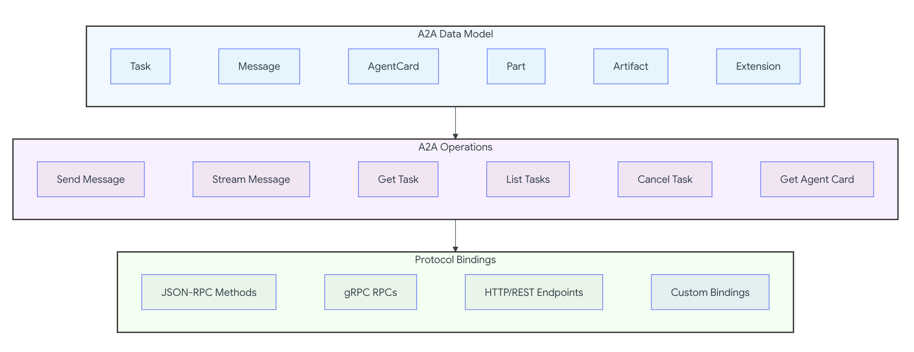
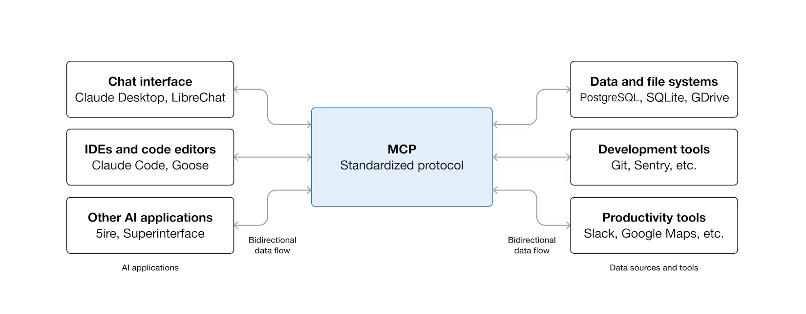

# AI 에이전트 프로토콜

## 개요

AI 에이전트 프로토콜은 인공지능 에이전트 간, 그리고 AI 에이전트 와 다른 시스템 간의 통신 표준을 정의합니다.

이러한 프로토콜은 메시지의 구문, 구조 및 순서뿐만 아니라 에이전트가 대화에서 맡는 역할, 메시지에 응답하는 시점과 방식과 같은 통신 규칙을 명시합니다.

## ACP (Agent Communication Protocol)

ACP는 AI 에이전트 간의 상호 운용성을 위한 오픈 프로토콜입니다. (A2A와 통합 중)

### ACP란?

서로 다른 프레임워크로 구축된 AI 에이전트들이 표준화된 RESTful API를 통해 통신할 수 있게 해주는 프로토콜입니다.

에이전트가 BeeAI, LangChain, CrewAI 등 어떤 프레임워크로 만들어졌든 관계없이 협업할 수 있습니다.

### 주요 기능

- REST 기반 통신
    - JSON-RPC 같은 특수한 방식 대신 표준 HTTP 패턴을 사용해 프로덕션 환경에 쉽게 통합됩니다.
- 모든 메시지 타입 지원
    - MimeType을 사용하여 텍스트, 이미지, 오디오, 비디오 등 모든 데이터 형식을 처리합니다.
- SDK 선택사항
    - curl이나 Postman 같은 표준 HTTP 도구로 사용 가능하며, Python과 TypeScript SDK도 제공됩니다.
- 비동기 우선, 동기 지원
    - 장시간 실행되는 에이전트 작업을 위해 비동기 통신을 기본으로 하면서 동기 통신도 완벽하게 지원합니다.
- 오프라인 검색
    - 에이전트가 비활성 상태일 때도 메타데이터를 통해 검색 가능합니다

### ACP 표준 Message 구조

```json
{
  "role": "user | agent | agent/{agent_name}",
  "parts": [
    {
      "name": "optional-part-name",
      "content_type": "text/plain",
      "content": "message content",
      "content_encoding": "plain",
      "content_url": null,
      "metadata": {
        // Citation 또는 Trajectory 메타데이터
      }
    }
  ]
}
```

## A2A (Agent2Agent Protocol)

A2A 프로토콜은 독립적이고 불투명한(opaque) AI 에이전트 시스템 간 통신과 상호운용을 위한 오픈 표준입니다.

Google이 2025년 4월 발표하고 현재 Linux Foundation에서 관리합니다.

### 핵심 설계 원칙

- Simple (단순성)
    - HTTP, JSON-RPC 2.0, SSE 등 기존 표준 재사용
- Enterprise Ready (엔터프라이즈 준비)
    - 인증, 권한, 보안, 추적 지원
- Async First (비동기 우선)
    - 장기 실행 작업 및 인간 개입 시나리오 지원
- Modality Agnostic (모달리티 무관)
    - 다양한 컨텐츠 타입 지원
- Opaque Execution (불투명 실행)
    - 내부 구현 공유 없이 협업

### 프로토콜 스펙 구조



- Layer 1: 정규 데이터 모델 (Canonical Data Model)
    - 모든 A2A 구현이 반드시 이해해야 하는 핵심 데이터 구조와 메시지 형식을 정의합니다. 이는 Protocol Buffer 메시지로 표현된 프로토콜 독립적 정의입니다.
- Layer 2: 추상 작업 (Abstract Operations)
    - 특정 프로토콜을 통해 어떻게 노출되는지와 무관하게, A2A 에이전트가 반드시 지원해야 하는 기본 기능과 동작을 설명합니다.
- Layer 3: 프로토콜 바인딩 (Protocol Bindings)
    - 추상 작업과 데이터 구조를 특정 프로토콜 바인딩(JSON-RPC, gRPC, HTTP/REST)에 구체적으로 매핑하는 방법을 제공합니다. 여기에는 메서드 이름, 엔드포인트 패턴, 프로토콜별 동작이
      포함됩니다.

이러한 계층화 접근 방식은 다음을 보장합니다:

- 핵심 의미론이 모든 프로토콜 바인딩에서 일관성 유지: 프로토콜이 달라져도 기본 개념과 동작 방식은 동일하게 유지됩니다.
- 기본 데이터 모델 변경 없이 새로운 프로토콜 바인딩 추가 가능: 새로운 통신 프로토콜을 지원하려 할 때 Layer 1과 2는 그대로 두고 Layer 3만 추가하면 됩니다.
- 개발자가 바인딩 문제와 독립적으로 A2A 작업에 대해 추론 가능: 어떤 프로토콜을 쓸지 고민하지 않고도 A2A가 제공하는 기능 자체를 이해하고 활용할 수 있습니다.
- 정규 데이터 모델에 대한 공유된 이해를 통해 상호운용성 유지: 서로 다른 구현체들이 같은 데이터 구조를 이해하므로 원활하게 협업할 수 있습니다.

### 프로토콜 핵심 개념 (Core Concepts)

핵심 참여자 (Core Actors)

1. User (사용자)
    - 정의: 최종 사용자 (인간 운영자 또는 자동화 서비스)
    - 역할: 하나 이상의 AI 에이전트로부터 도움이 필요한 요청을 시작하거나 목표를 정의
2. A2A Client (클라이언트 에이전트)
    - 정의: 사용자를 대신하여 행동하는 애플리케이션, 서비스 또는 다른 AI 에이전트
    - 역할: A2A 프로토콜을 사용하여 통신을 시작
3. A2A Server (원격 에이전트)
    - 정의: A2A 프로토콜을 구현하는 HTTP 엔드포인트를 노출하는 AI 에이전트 또는 에이전트 시스템
    - 역할: 클라이언트의 요청을 받아 작업을 처리하고 결과 또는 상태 업데이트를 반환
    - 특징: 클라이언트 관점에서 불투명(opaque, 블랙박스) 시스템으로 작동 - 내부 작동 방식, 메모리, 도구는 노출되지 않음

### 핵심 요소 비교표

| 요소             | 설명                                                                        | 핵심 목적                                              |
|----------------|---------------------------------------------------------------------------|----------------------------------------------------|
| **Agent Card** | 에이전트의 신원, 기능, 엔드포인트, 스킬, 인증 요구사항을 설명하는 JSON 메타데이터 문서                      | 클라이언트가 에이전트를 발견하고 안전하고 효과적으로 상호작용하는 방법을 이해할 수 있게 함 |
| **Task**       | 에이전트가 시작한 상태를 가진(stateful) 작업 단위, 고유 ID와 정의된 생명주기를 가짐                     | 장기 실행 작업 추적 촉진, 멀티턴 상호작용 및 협업 가능                   |
| **Message**    | 클라이언트와 에이전트 간의 단일 턴 통신, 콘텐츠와 역할("user" 또는 "agent")을 포함                    | 반드시 공식 아티팩트는 아닌 지시, 컨텍스트, 질문, 답변 또는 상태 업데이트 전달     |
| **Part**       | Message 및 Artifact 내에서 사용되는 기본 콘텐츠 컨테이너 (예: TextPart, FilePart, DataPart) | 에이전트가 메시지 및 아티팩트 내에서 다양한 콘텐츠 타입을 교환할 수 있는 유연성 제공   |
| **Artifact**   | 작업 중 에이전트가 생성한 구체적 출력물 (예: 문서, 이미지, 구조화 데이터)                              | 에이전트 작업의 구체적 결과 제공, 구조화되고 검색 가능한 출력 보장             |

### 상호작용 메커니즘 (Interaction Mechanisms)

A2A는 응답성과 지속성에 대한 다양한 요구를 수용하기 위해 여러 상호작용 패턴을 지원합니다.

#### 1. Request/Response (폴링)

```
Client ──→ Request  ──→ Server
Client ←── Response ←── Server

장기 실행 작업의 경우:
Client ──→ 주기적 폴링   ──→ Server
       ←── 상태 업데이트 ←──
```

- **방식:** 클라이언트가 요청을 보내면 서버가 응답
- **장기 작업:** 클라이언트가 주기적으로 서버를 폴링하여 업데이트 확인
- **장점:** 간단한 구현
- **단점:** 높은 지연, 불필요한 요청 가능

#### 2. Streaming with SSE (Server-Sent Events)

```
Client ──→ 스트림 시작    ──→ Server
       ←── 실시간 업데이트 ←── (연결 유지)
       ←── 증분 결과     ←──
       ←── 상태 변경     ←──
```

- **방식:** 열린 HTTP 연결을 통해 실시간 증분 결과 또는 상태 업데이트 수신
- **장점:** 낮은 지연, 실시간 피드백
- **단점:** 지속적 연결 필요
- **적합:** 대화형 애플리케이션, 실시간 모니터링

#### 3. Push Notifications (WebHook)

```
Client ──→ Webhook URL 등록 ──→ Server

작업 업데이트 발생 시:
Server ──→ HTTP POST (Webhook) ──→ Client의 Webhook
```

- **방식:** 중요한 작업 업데이트 발생 시 서버가 클라이언트 제공 Webhook으로 비동기 알림 전송
- **장점:** 연결 유지 불필요, 초장기 작업 처리
- **적합:** 연결 해제 시나리오, 매우 긴 작업

## MCP (Model Context Protocol)

### MCP란?

Model Context Protocol (MCP)는 AI 애플리케이션을 외부 시스템에 연결하기 위한 오픈소스 표준 프로토콜입니다.

> "MCP는 AI 애플리케이션을 위한 USB-C 포트"
>
> USB-C가 전자 기기를 연결하는 표준화된 방법을 제공하는 것처럼, MCP는 AI 애플리케이션을 외부 시스템에 연결하는 표준화된 방법을 제공합니다.



### MCP 아키텍처 주요 참여자

1. **MCP 호스트**: 하나 이상의 MCP 클라이언트를 조정하고 관리하는 AI 애플리케이션
2. **MCP 클라이언트**: MCP 서버와의 연결을 유지하고 MCP 호스트가 사용할 컨텍스트 정보를 MCP 서버로부터 가져오는 구성 요소
3. **MCP 서버**: MCP 클라이언트에 컨텍스트 정보를 제공하는 프로그램

### MCP 계층 구조 (Layers)

**📚 2계층 아키텍처**

```
┌─────────────────────────────────────┐
│   Transport Layer (외부 계층)       │
│  ┌───────────────────────────────┐  │
│  │  Data Layer (내부 계층)       │  │
│  └───────────────────────────────┘  │
└─────────────────────────────────────┘
```

**MCP는 2개 계층으로 구성:**

- **Data Layer** (내부)
- **Transport Layer** (외부)

---

1️⃣ Data Layer (데이터 계층): **JSON-RPC 2.0 기반 교환 프로토콜로 메시지 구조 및 의미 정의**

1. Lifecycle Management (생명주기 관리)
    - 연결 초기화
    - 기능 협상
    - 연결 종료

2. Server Features (서버 기능)
    - **Tools** - AI 작업용
    - **Resources** - 컨텍스트 데이터용
    - **Prompts** - 상호작용 템플릿

3. Client Features (클라이언트 기능)
    - **Sampling** - 호스트 LLM에서 샘플링
    - **Elicitation** - 사용자 입력 요청
    - **Logging** - 로그 메시지 전송

4. Utility Features (유틸리티 기능)
    - **Notifications** - 실시간 업데이트
    - **Progress Tracking** - 장기 실행 작업 진행 상황

---

2️⃣ Transport Layer (전송 계층): **통신 채널 및 인증 관리**

- 역할
    - 연결 설정
    - 메시지 프레이밍
    - MCP 참여자 간 보안 통신
- 2가지 전송 메커니즘
    - Stdio Transport
        - 표준 입출력 스트림 사용
        - 로컬 프로세스 간 직접 통신
        - 최적 성능, 네트워크 오버헤드 없음
    - Streamable HTTP Transport
        - 클라이언트→서버: HTTP POST
        - 서버→클라이언트: SSE (Server-Sent Events, 선택)
        - 원격 서버 통신 지원
        - 인증 방법: Bearer tokens, API keys, Custom headers
        - **권장:** OAuth로 인증 토큰 획득

> **추상화**
>
> 전송 계층은 프로토콜 계층에서 통신 세부 사항을 추상화하여, **모든 전송 메커니즘에서 동일한 JSON-RPC 2.0 메시지 형식 사용 가능**

---

# MCP 계층 구조 (Layers)

## 📊 전체 구조 비교표

| 구분            | Data Layer (내부)                                                    | Transport Layer (외부)                             |
|---------------|--------------------------------------------------------------------|--------------------------------------------------|
| **역할**        | 메시지 **의미** 정의                                                      | 메시지 **전달** 방법                                    |
| **기반**        | JSON-RPC 2.0                                                       | STDIO / HTTP+SSE                                 |
| **관리**        | • 생명주기 (초기화/협상/종료)<br>• 메시지 구조 및 의미                                | • 연결 설정<br>• 메시지 프레이밍<br>• 인증                    |
| **Server 기능** | • Tools (도구)<br>• Resources (리소스)<br>• Prompts (프롬프트)              | -                                                |
| **Client 기능** | • Sampling (LLM 완성 요청)<br>• Elicitation (사용자 입력)<br>• Logging (로그) | -                                                |
| **유틸리티**      | • Notifications (알림)<br>• Tasks (작업, 실험적)                          | -                                                |
| **전송 방식**     | -                                                                  | • **STDIO**: 로컬, 빠름<br>• **HTTP+SSE**: 원격, 인증 지원 |
| **핵심 개념**     | **Primitives** (가장 중요)                                             | 추상화 (동일 메시지 형식)                                  |

---

## 🎯 Primitives 상세

| Primitive         | 타입      | 메서드                                  | 역할        | 예시                    |
|-------------------|---------|--------------------------------------|-----------|-----------------------|
| **Tools**         | Server  | `tools/list`<br>`tools/call`         | 실행 가능한 함수 | 파일 작업, API 호출, DB 쿼리  |
| **Resources**     | Server  | `resources/list`<br>`resources/read` | 컨텍스트 데이터  | 파일 내용, DB 레코드, API 응답 |
| **Prompts**       | Server  | `prompts/list`<br>`prompts/get`      | 상호작용 템플릿  | 시스템 프롬프트, Few-shot 예제 |
| **Sampling**      | Client  | `sampling/complete`                  | LLM 완성 요청 | 서버가 모델 독립적 유지         |
| **Elicitation**   | Client  | `elicitation/request`                | 사용자 입력 요청 | 추가 정보, 확인 요청          |
| **Logging**       | Client  | -                                    | 로그 메시지 전송 | 디버깅, 모니터링             |
| **Tasks**         | Utility | -                                    | 지속 실행 래퍼  | 장기 작업 상태 추적 (실험적)     |
| **Notifications** | Utility | `notifications/*`                    | 실시간 알림    | 도구/리소스 변경 알림          |

---

## ✅ 핵심 요약

**구조:**

```
Transport Layer (외부) - 어떻게 전달
  └─ Data Layer (내부) - 무엇을 전달
```

**특징:**

- Data Layer = **Primitives 정의** (가장 중요)
- Transport Layer = **전송 방식** (STDIO/HTTP)
- 모든 전송에서 **동일한 JSON-RPC 2.0 형식**

## ACP vs A2A vs MCP

### 📊 핵심 비교표

| 구분       | ACP                    | A2A                         | MCP                  |
|----------|------------------------|-----------------------------|----------------------|
| **목적**   | 에이전트 간 통신              | 에이전트 간 통신                   | LLM ↔ 도구/데이터 연결      |
| **개발**   | IBM Research (2025.03) | Google Cloud (2025.04)      | Anthropic (2024.11)  |
| **관리**   | Linux Foundation       | Linux Foundation            | Linux Foundation     |
| **현황**   | A2A 통합 중               | v0.3.0, 150+ 조직             | 사실상 표준               |
| **철학**   | REST 단순성               | 엔터프라이즈 준비                   | 도구 통합 표준화            |
| **프로토콜** | REST                   | JSON-RPC/gRPC/REST          | JSON-RPC 2.0         |
| **상태**   | Session 기반             | Task 기반 (stateful)          | Stateful             |
| **계층**   | 단일                     | 3계층 (Data/Abstract/Binding) | 2계층 (Data/Transport) |

---

### 🎯 사용 목적 비교

| 항목         | ACP         | A2A         | MCP          |
|------------|-------------|-------------|--------------|
| **주요 사용처** | 에이전트 ↔ 에이전트 | 에이전트 ↔ 에이전트 | AI ↔ 외부 시스템  |
| **통신 대상**  | AI 에이전트들    | AI 에이전트들    | LLM + 도구/데이터 |
| **해결 문제**  | 에이전트 협업     | 에이전트 워크플로우  | N×M 통합 문제    |
| **초점**     | 메시지 교환      | 작업 관리       | 컨텍스트 제공      |

---

### 🏗️ 아키텍처 비교

| 요소        | ACP                 | A2A                              | MCP                  |
|-----------|---------------------|----------------------------------|----------------------|
| **구조**    | 단일 REST API         | 3계층 (Canonical/Abstract/Binding) | 2계층 (Data/Transport) |
| **메시지**   | role + parts (MIME) | Message + Part (3타입)             | JSON-RPC 2.0         |
| **상태 관리** | Session             | Context + Task                   | Lifecycle            |
| **발견**    | Agent Manifest      | Agent Card + Well-Known          | 동적 list 메서드          |

---

### 📦 핵심 구성 요소

| 구성           | ACP                  | A2A                        | MCP                          |
|--------------|----------------------|----------------------------|------------------------------|
| **기본 단위**    | Message (role+parts) | Task, Message, Artifact    | Primitives                   |
| **서버 제공**    | Tools (암묵적)          | Task 생성/관리                 | Tools/Resources/Prompts      |
| **클라이언트 제공** | -                    | Sampling (선택)              | Sampling/Elicitation/Logging |
| **데이터 타입**   | MIME 무제한             | TextPart/FilePart/DataPart | TextPart/FilePart/DataPart   |
| **메타데이터**    | Citation/Trajectory  | Extensions                 | 동적 발견                        |

---

### 🔄 통신 플로우

| 항목        | ACP                      | A2A                   | MCP                        |
|-----------|--------------------------|-----------------------|----------------------------|
| **프로토콜**  | REST                     | JSON-RPC/gRPC         | JSON-RPC 2.0               |
| **요청 방식** | POST /agents/{name}/runs | message/send          | tools/call, resources/read |
| **응답**    | {run_id, status, output} | Task 또는 Message       | result 또는 notification     |
| **실행 모드** | sync/async/stream        | blocking/non-blocking | 요청/응답 + 알림                 |
| **업데이트**  | 폴링/스트리밍(SSE)             | 폴링/SSE/WebHook        | Notifications              |

---

### 🌐 전송 메커니즘

| 전송       | ACP           | A2A                | MCP                |
|----------|---------------|--------------------|--------------------|
| **로컬**   | -             | -                  | STDIO (최적화)        |
| **원격**   | REST (HTTP)   | JSON-RPC/gRPC/HTTP | HTTP + SSE         |
| **스트리밍** | SSE           | SSE                | SSE                |
| **Push** | 미지원           | WebHook            | Notifications      |
| **인증**   | OAuth/API Key | OAuth/API Key/mTLS | OAuth/Bearer Token |

---

### 🎨 핵심 Primitives/기능

#### ACP

| 기능         | 설명                     |
|------------|------------------------|
| Message    | role + parts (MIME 타입) |
| Session    | 상태 유지                  |
| Citation   | 출처 메타데이터               |
| Trajectory | 도구 호출 기록               |

#### A2A

| 기능       | 설명          |
|----------|-------------|
| Task     | 상태 있는 작업 단위 |
| Message  | 단일 턴 통신     |
| Artifact | 구체적 결과물     |
| Context  | 작업 그룹화      |

#### MCP

| 기능                | 설명        |
|-------------------|-----------|
| **Tools**         | 실행 가능한 함수 |
| **Resources**     | 컨텍스트 데이터  |
| **Prompts**       | 상호작용 템플릿  |
| **Sampling**      | LLM 완성 요청 |
| **Notifications** | 실시간 알림    |

---

### 📋 작업 생명주기

| 상태     | ACP         | A2A            | MCP        |
|--------|-------------|----------------|------------|
| **초기** | created     | SUBMITTED      | initialize |
| **진행** | in-progress | WORKING        | ready      |
| **대기** | awaiting    | INPUT_REQUIRED | -          |
| **완료** | completed   | COMPLETED      | disconnect |
| **실패** | failed      | FAILED         | error      |

---

### 🔐 보안 및 인증

| 항목     | ACP               | A2A                 | MCP                 |
|--------|-------------------|---------------------|---------------------|
| **인증** | OAuth, API Key    | OAuth, mTLS, OpenID | OAuth, Bearer Token |
| **권한** | Capability Tokens | Role 기반             | Host 제어             |
| **보안** | 기본                | 엔터프라이즈급             | Sandbox, 최소 권한      |

---

### 💼 사용 사례

| 시나리오       | ACP     | A2A        | MCP                  |
|------------|---------|------------|----------------------|
| **AI 코딩**  | 에이전트 협업 | 에이전트 워크플로우 | IDE + GitHub + 파일시스템 |
| **데이터 분석** | 멀티 에이전트 | Task 기반 분석 | LLM + DB + Sheets    |
| **엔터프라이즈** | -       | 복잡한 워크플로우  | 도구 통합                |
| **채팅봇**    | 에이전트 체인 | 멀티턴 대화     | 컨텍스트 제공              |

---

### ⚡ 장단점 비교

#### ACP

| 장점             | 단점         |
|----------------|------------|
| ✅ REST 직관적     | ❌ 단일 프로토콜  |
| ✅ MIME 무제한     | ❌ A2A 통합 중 |
| ✅ Citation 표준화 | ❌ Push 미지원 |

#### A2A

| 장점                  | 단점           |
|---------------------|--------------|
| ✅ 다중 프로토콜           | ❌ 복잡한 3계층    |
| ✅ 엔터프라이즈급           | ❌ 학습 곡선 높음   |
| ✅ Push Notification | ❌ Part 타입 제한 |
| ✅ 150+ 조직 지원        | -            |

#### MCP

| 장점              | 단점              |
|-----------------|-----------------|
| ✅ **사실상 표준**    | ❌ 에이전트 간 통신 미지원 |
| ✅ **N+M 문제 해결** | ❌ 보안 이슈 존재      |
| ✅ **간단한 2계층**   | -               |
| ✅ **동적 발견**     | -               |
| ✅ **광범위 채택**    | -               |

---

## 🔗 함께 사용하기

```
User Application
    ↓
Agent (ADK)
  ├─ MCP → 도구/데이터
  │   ├─ Google Drive
  │   ├─ PostgreSQL
  │   └─ Slack
  │
  └─ A2A → 다른 에이전트
      ├─ 전문 에이전트 1
      ├─ 전문 에이전트 2
      └─ 전문 에이전트 3
```

**역할 분담:**

- **MCP**: 단일 에이전트 ↔ 외부 시스템
- **A2A**: 에이전트 ↔ 에이전트

---

## 📌 핵심 요약

| 프로토콜    | 한 줄 정의         | 주요 특징                   |
|---------|----------------|-------------------------|
| **ACP** | 에이전트 통신 (REST) | 단순, A2A 통합 중            |
| **A2A** | 에이전트 협업 표준     | 엔터프라이즈, 3계층, Task 기반    |
| **MCP** | AI-도구 연결 표준    | 사실상 표준, Primitives, 2계층 |

**결론:**

- **도구 통합** → **MCP**
- **에이전트 협업** → **A2A**
- **함께 사용** → **완전한 AI 생태계**
